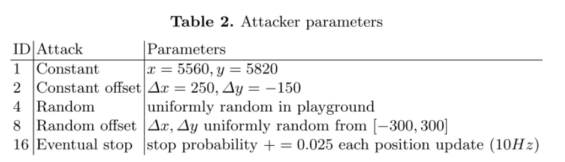

## VeReMi中的五种攻击类型实现方法

### 项目来源
- [Paper: https://arxiv.org/abs/1804.06701](https://arxiv.org/abs/1804.06701)
- [GitHub: https://github.com/VeReMi-dataset](https://github.com/VeReMi-dataset)
- [https://veremi-dataset.github.io/](https://veremi-dataset.github.io/)


### 攻击场景描述
攻击具体情况如下：

<div style="text-align: center;">

</div>


#### 场景描述
- Constant：车辆广播固定位置（5560, 5820）
- Constant offset：车辆广播真实位置+固定偏移（x+250, y-150）
- Random：车辆广播地图区域随机位置
- Random offset：车辆广播真实位置+随机偏移（x+▲, y+▲）
- Eventual stop：重复发送当前位置，就像已经停止了一样


### Veins-SUMO-OMNeT++代码实现
```cpp
// TraCIDemo11p.cc
void TraCIDemo11p::handlePositionUpdate(cObject* obj)
{
    DemoBaseApplLayer::handlePositionUpdate(obj);

    // 真实beacon消息内容
    double pos_x = mobility->getPositionAt(simTime()).x;
    double pos_y = mobility->getPositionAt(simTime()).y;
    double speed = mobility->getSpeed();
    double acceleration = mobility->getVehicleCommandInterface()->getAcceleration();
    double direction = mobility->getVehicleCommandInterface()->getAngle();
    double timestamp = simTime().dbl();

    if (!isMalicious) { 
        ostringstream oss;
        oss << RID << "||" << pos_x << "||" << pos_y << "||" << speed << "||" << acceleration << "||" << direction << "||" << timestamp;
        string beaconMsg = oss.str();

        TraCIDemo11pMessage* newWSM = new TraCIDemo11pMessage();
        populateWSM(newWSM);
        newWSM->setMsgData(beaconMsg.data());
        sendDelayedDown(newWSM->dup(), uniform(0.01, 0.1));

        delete newWSM;
    }

    if (isMalicious) {

        int MalBehaviorSelect = generateRandomNumber();
        if (MalBehaviorSelect == 1) { 
            ostringstream oss;
            oss << VID << "||" << 0 << "||" << 0 << "||" << 0 << "||" << 0 << "||" << 0 << "||" << timestamp;
            string beaconMsg = oss.str();
            cout << "恶意行为1：" << "恶意车辆[" << RID << "]广播固定beacon消息：" << beaconMsg << endl;

            TraCIDemo11pMessage* newWSM = new TraCIDemo11pMessage();
            populateWSM(newWSM);
            newWSM->setMsgData(beaconMsg.data());
            sendDelayedDown(newWSM->dup(), uniform(0.01, 0.1));

            delete newWSM;

        } else if (MalBehaviorSelect == 2) { 
            Coord vpos = generateRandomPosition(2500, 2500); 
            pos_x = vpos.x;
            pos_y = vpos.y;
            speed = generateRandomSpeed(0, 30);
            acceleration = generateRandomAcceleration(0, 2.5);
            direction = generateRandomDirection();
            timestamp = simTime().dbl();

            ostringstream oss;
            oss << VID << "||" << pos_x << "||" << pos_y << "||" << speed << "||" << acceleration << "||" << direction << "||" << timestamp;
            string beaconMsg = oss.str();
            cout << "恶意行为2：" << "恶意车辆[" << RID << "]广播随机beacon消息：" << beaconMsg << endl;

            TraCIDemo11pMessage* newWSM = new TraCIDemo11pMessage();
            populateWSM(newWSM);
            newWSM->setMsgData(beaconMsg.data());
            sendDelayedDown(newWSM->dup(), uniform(0.01, 0.1));

            delete newWSM;

        } else if (MalBehaviorSelect == 3) {
            double pos_x_add = 10;
            double pos_y_add = 10;
            double speed_add = 1;
            double acceleration_add = 1;
            double direction_add = 1;
            timestamp = simTime().dbl();

            ostringstream oss;
            oss << VID << "||" << pos_x+pos_x_add  << "||" << pos_y+pos_y_add << "||" << speed+speed_add
                << "||" << acceleration+acceleration_add << "||" << direction+direction_add << "||" << timestamp;
            string beaconMsg = oss.str();
            cout << "恶意行为3：" << "恶意车辆[" << RID << "]广播真实位置+固定偏移beacon消息：" << beaconMsg << endl;

            // 打包消息
            TraCIDemo11pMessage* newWSM = new TraCIDemo11pMessage();
            populateWSM(newWSM);
            newWSM->setMsgData(beaconMsg.data());
            sendDelayedDown(newWSM->dup(), uniform(0.01, 0.1));

            delete newWSM;

        } else if (MalBehaviorSelect == 4) {
            Coord vpos = generateRandomPosition(2500, 2500); 
            double pos_x_add = vpos.x;
            double pos_y_add = vpos.y;
            double speed_add = generateRandomSpeed(0, 30);
            double acceleration_add = generateRandomAcceleration(0, 2.5);
            double direction_add = generateRandomDirection();

            timestamp = simTime().dbl();

            ostringstream oss;
            oss << VID << "||" << pos_x+pos_x_add  << "||" << pos_y+pos_y_add << "||" << speed+speed_add
                << "||" << acceleration+acceleration_add << "||" << direction+direction_add << "||" << timestamp;
            string beaconMsg = oss.str();
            cout << "恶意行为4：" << "恶意车辆[" << RID << "]广播真实位置+随机偏移beacon消息：" << beaconMsg << endl;

            // 打包消息
            TraCIDemo11pMessage* newWSM = new TraCIDemo11pMessage();
            populateWSM(newWSM);
            newWSM->setMsgData(beaconMsg.data());
            sendDelayedDown(newWSM->dup(), uniform(0.01, 0.1));

            delete newWSM;

        } else { // 可扩展设置默认恶意行为

        }

    }
}
```
