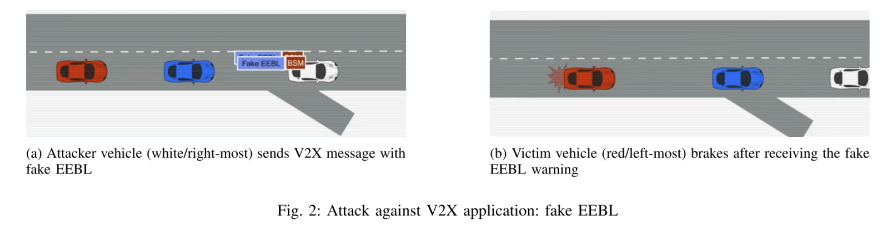

## 一种车联网位置伪造/虚假BSM消息攻击实现方法

### 项目来源
- [Paper](https://www.ndss-symposium.org/wp-content/uploads/2023/02/vehiclesec2023-23071-paper.pdf)
- [GitHub](https://github.com/quic/vasp)


### 场景及攻击效果描述
在车辆通信系统中，EEBL攻击（Emergency Electronic Brake Light Attack）是一种典型的安全威胁场景。这种攻击具体情况如下：

<div style="text-align: center;">

</div>

#### 场景描述
假设有两辆车在同一条道路上行驶，一辆在前，一辆在后。攻击者控制着前车，并在没有实际紧急刹车的情况下，故意发送一个虚假的紧急电子刹车灯（EEBL）信号。这个信号表明前车正在进行紧急制动。

#### 攻击效果
后车的通信系统接收到这个虚健的EEBL消息后，根据该信号的紧急性，可能会自动触发紧急制动系统，以避免假设中的即将发生的碰撞。


### Veins-SUMO-OMNeT++代码实现
简单来说，假设仿真场景中有两辆车，需要实现的就是
- 前车需要给后车发送一条虚假消息：“我要刹车了！”；
- 后车接收到消息后怕追尾相信了前车，立马跟着刹车。

### 核心代码
我们直接在veins示例代码框架下`TraCIDemo11p.cc`添加以下代码
```cpp
// 车辆接收消息处理函数
void TraCIDemo11p::onWSM(BaseFrame1609_4* frame)
{
    // 接收WSM消息处理函数
    TraCIDemo11pMessage* reWsm = check_and_cast<TraCIDemo11pMessage*>(frame);
    if (myId == 16) {
        cout << "车辆[" << myId << "]收到beacon消息：" << reWsm->getMsgData() << "，当前时间：" << simTime() << endl;
        mobility->getVehicleCommandInterface()->slowDown(2, 4); // slowDown(speed, time);表示time时间内速度减为speed
    }
}
// 车辆每次位置更新任务处理函数
void TraCIDemo11p::handlePositionUpdate(cObject* obj)
{
    DemoBaseApplLayer::handlePositionUpdate(obj);

    if (myId == 16) {
        cout << "车辆[" << myId << "]的当前速度为：" << mobility->getSpeed() << "，当前时间：" << simTime() << endl;
    }


    ostringstream oss;
    string beaconMsg;
    if (myId == 10 && simTime() > 60 && simTime() < 80) { // 60s-70s内持续发送虚假EBBL消息
        oss << "Fake EBBL"; // 消息内容，后期可以按需求改写消息内容，例如当前车辆位置、速度、加速度等BSM消息
        beaconMsg = oss.str();

        // 打包消息
        TraCIDemo11pMessage* newWSM = new TraCIDemo11pMessage();
        populateWSM(newWSM);
        newWSM->setMsgData(beaconMsg.data());
        sendDelayedDown(newWSM->dup(), uniform(0.01, 0.1)); // 设置随机时延，向下发，避免消息拥堵

        //cout << "车辆[" << myId << "]广播beacon消息：" << beaconMsg << "，当前时间：" << simTime() << endl;

        delete newWSM; // 删除消息，避免内存泄露
    }
}
```